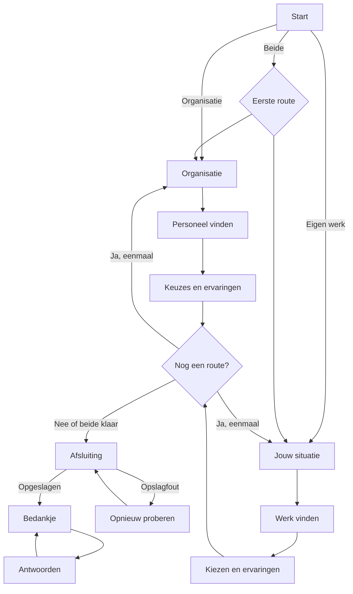

# Schermkaart

```mermaid
graph TD
Start[Start] -->|Organisatie| A1[Organisatie]
Start -->|Eigen werk| B1[Jouw situatie]
Start -->|Beide| Eerste{Eerste route}
Eerste --> A1
Eerste --> B1
A1 --> A2[Personeel vinden]
A2 --> A3[Keuzes en ervaringen]
B1 --> B2[Werk vinden]
B2 --> B3[Kiezen en ervaringen]
A3 --> Route{Nog een route?}
B3 --> Route
Route -->|Ja, eenmaal| A1
Route -->|Ja, eenmaal| B1
Route -->|Nee of beide klaar| Slot[Afsluiting]
Slot -->|Opslagfout| Fout[Opnieuw proberen]
Fout --> Slot
Slot -->|Opgeslagen| Bedankt[Bedankje]
Bedankt --> Review[Antwoorden]
Review --> Bedankt

classDef screen fill:#e8e8e8,stroke:#999,stroke-width:2px
```

Geen HTTP-verzoek tot de gezamenlijke afsluiting. De eerste route en het optionele tweede perspectief worden in de formulierstaat bijgehouden.

