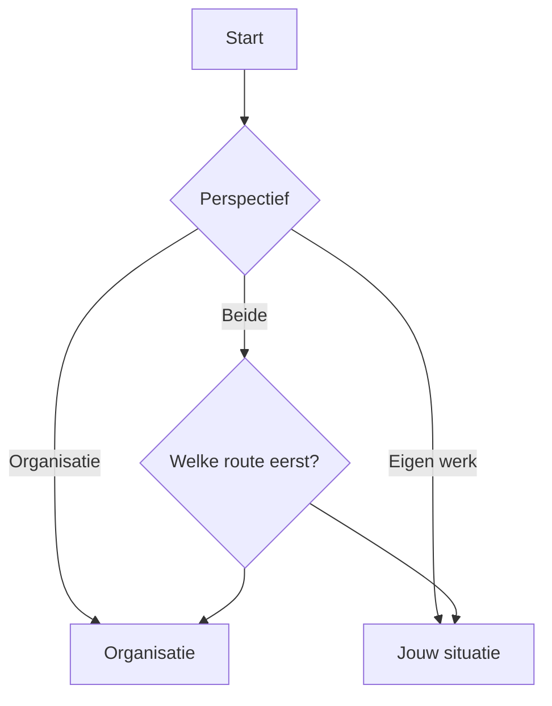

# uc-001: Perspectief kiezen

```mermaid
graph TD
Start[Start] --> Keuze{Perspectief}
Keuze -->|Organisatie| Organisatie[Organisatie]
Keuze -->|Eigen werk| Situatie[Jouw situatie]
Keuze -->|Beide| Eerst{Welke route eerst?}
Eerst --> Organisatie
Eerst --> Situatie
classDef screen fill:#e8e8e8,stroke:#999,stroke-width:2px
```

