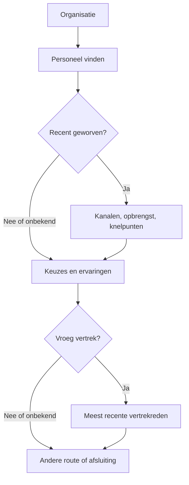

# uc-002: Organisatievragen

```mermaid
graph TD
Organisatie[Organisatie] --> Werving[Personeel vinden]
Werving --> Ervaring{Recent geworven?}
Ervaring -->|Ja| Kanalen[Kanalen, opbrengst, knelpunten]
Ervaring -->|Nee of onbekend| Keuzes[Keuzes en ervaringen]
Kanalen --> Keuzes
Keuzes --> Vertrek{Vroeg vertrek?}
Vertrek -->|Ja| Reden[Meest recente vertrekreden]
Vertrek -->|Nee of onbekend| Verder[Andere route of afsluiting]
Reden --> Verder
classDef screen fill:#e8e8e8,stroke:#999,stroke-width:2px
```

