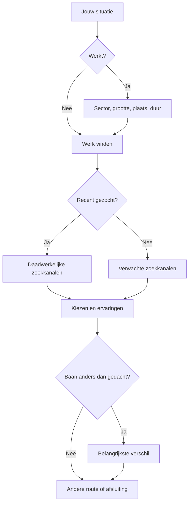

# uc-003: Eigen werk en studie

```mermaid
graph TD
Situatie[Jouw situatie] --> Werkt{Werkt?}
Werkt -->|Ja| Werk[Sector, grootte, plaats, duur]
Werkt -->|Nee| Zoeken[Werk vinden]
Werk --> Zoeken
Zoeken --> Recent{Recent gezocht?}
Recent -->|Ja| Ervaren[Daadwerkelijke zoekkanalen]
Recent -->|Nee| Verwacht[Verwachte zoekkanalen]
Ervaren --> Keuzes[Kiezen en ervaringen]
Verwacht --> Keuzes
Keuzes --> Afwijking{Baan anders dan gedacht?}
Afwijking -->|Ja| Verschil[Belangrijkste verschil]
Afwijking -->|Nee| Verder[Andere route of afsluiting]
Verschil --> Verder
classDef screen fill:#e8e8e8,stroke:#999,stroke-width:2px
```

