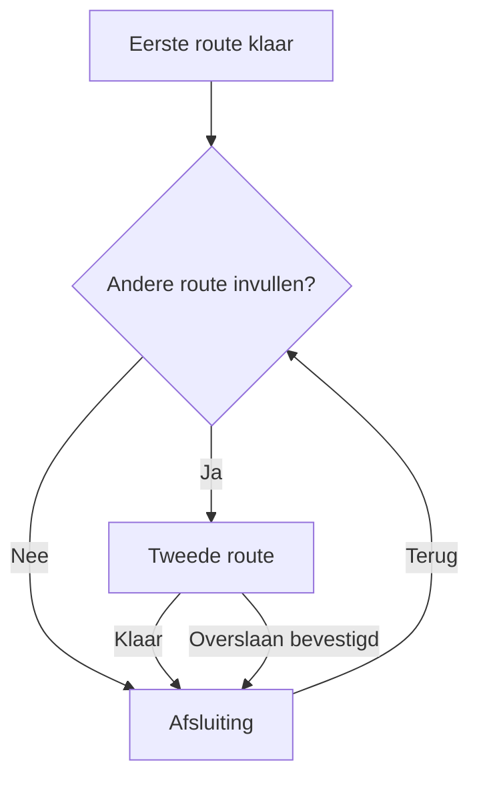

# uc-004: Tweede perspectief

```mermaid
graph TD
Eerste[Eerste route klaar] --> Keuze{Andere route invullen?}
Keuze -->|Ja| Tweede[Tweede route]
Keuze -->|Nee| Slot[Afsluiting]
Tweede -->|Klaar| Slot
Tweede -->|Overslaan bevestigd| Slot
Slot -->|Terug| Keuze
classDef screen fill:#e8e8e8,stroke:#999,stroke-width:2px
```

