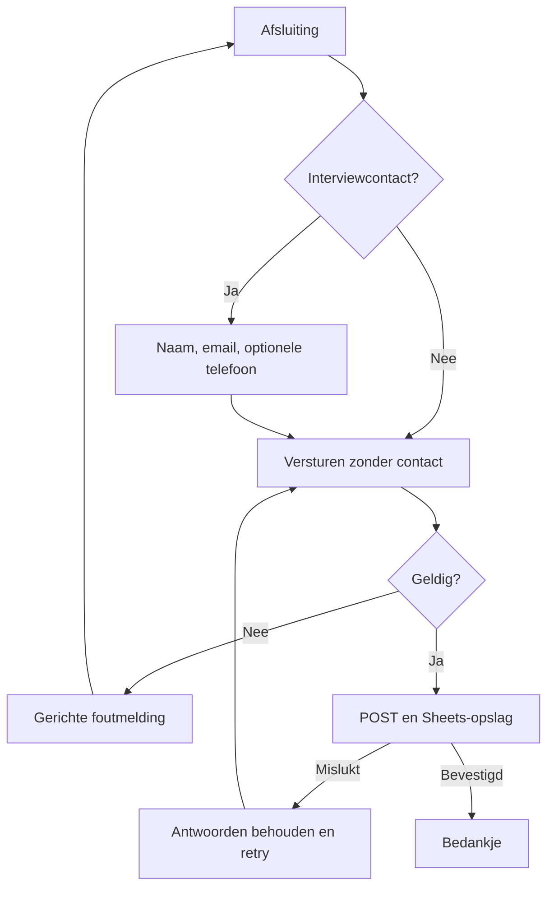

# uc-005: Opslaan en vrijwillig contact

```mermaid
graph TD
Slot[Afsluiting] --> Contact{Interviewcontact?}
Contact -->|Ja| Velden[Naam, email, optionele telefoon]
Contact -->|Nee| Verstuur[Versturen zonder contact]
Velden --> Verstuur
Verstuur --> Validatie{Geldig?}
Validatie -->|Nee| Fout[Gerichte foutmelding]
Fout --> Slot
Validatie -->|Ja| Opslaan[POST en Sheets-opslag]
Opslaan -->|Mislukt| Opnieuw[Antwoorden behouden en retry]
Opnieuw --> Verstuur
Opslaan -->|Bevestigd| Bedankt[Bedankje]
classDef screen fill:#e8e8e8,stroke:#999,stroke-width:2px
```

