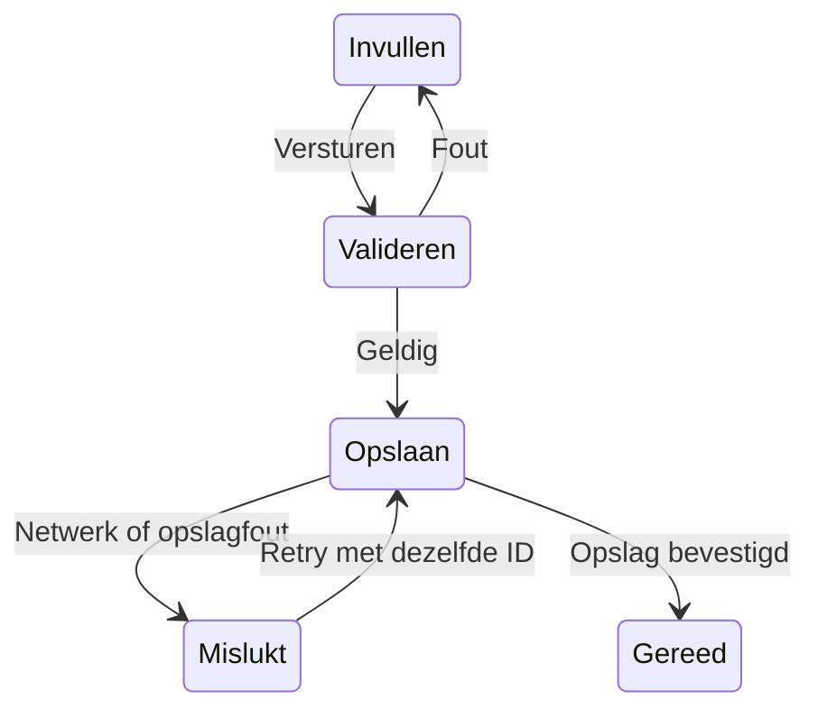

# uc-005: toestanden

```mermaid
stateDiagram-v2
Invullen --> Valideren: Versturen
Valideren --> Invullen: Fout
Valideren --> Opslaan: Geldig
Opslaan --> Mislukt: Netwerk of opslagfout
Mislukt --> Opslaan: Retry met dezelfde ID
Opslaan --> Gereed: Opslag bevestigd
```

